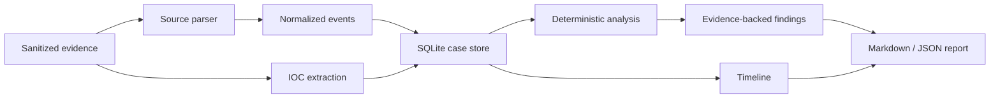

# SOC CaseForge

[](https://github.com/Z3X-1337/soc-caseforge/actions/workflows/tests.yml)


SOC CaseForge is a local-first Python workspace for turning sanitized analyst evidence into a structured incident case. It stores cases in SQLite, parses supported OpenSSH authentication events, extracts common indicators, applies deterministic detection heuristics, and renders reviewable Markdown or JSON reports.

It is designed as a portfolio-grade SOC workflow and an early product foundation. It is not a SIEM, EDR, malware sandbox, or autonomous analyst.

## Portfolio evidence

| Area | Current evidence |
| --- | --- |
| Workflow | Case creation → evidence ingestion → timeline → indicators → findings → report |
| Persistence | SQLite-backed cases, events, indicators, and findings |
| Detection | Repeated failures, password-spray-style behavior, and success after failures |
| Explainability | Evidence, confidence, ATT&CK assistance, limitations, and recommended actions |
| Engineering | Installable CLI, 24 tests, CI on Python 3.10–3.12, threat model, and security policy |
| Privacy | Local processing with no external enrichment or evidence upload by default |

## Why this project exists

Small scripts often stop at a single parser, threshold, or output format. SOC CaseForge connects the analyst workflow:

1. create a case;
2. ingest authorized evidence;
3. preserve a normalized timeline;
4. extract indicators;
5. run explainable detections;
6. produce a reviewable report.

All processing is local. No evidence is uploaded to an external service.

## Data flow



## Current capabilities

- SQLite-backed case storage.
- OpenSSH failed and accepted authentication parsing.
- IPv4 and IPv6 support.
- IOC extraction for URLs, domains, email addresses, IPs, and common hashes.
- Repeated-failure, password-spray-style, and success-after-failure findings.
- Evidence and confidence attached to every finding.
- MITRE ATT&CK assistance for T1110 and T1110.003.
- Markdown and JSON reporting.
- Installable `soc-caseforge` CLI.
- Standard-library runtime with no external dependencies.

## Demonstration

Run the built-in sanitized scenario:

```bash
soc-caseforge --db demo.db demo
```

The scenario produces six timeline events, two indicators, and three findings, including a successful login after earlier failures. Review the committed [demonstration report](docs/demo-report.md) for the complete output.

Example finding:

```text
[HIGH] Successful login after failures for analyst
Evidence: source_ip=203.0.113.10; user=analyst; prior_failures=2
ATT&CK assistance: T1110 Brute Force
Next actions: validate the login, review the session, and contain the account if unauthorized.
```

## Installation

```bash
python -m pip install .
```

For an isolated command-line installation:

```bash
pipx install .
```

## Quick start

```bash
soc-caseforge --db cases.db init
soc-caseforge --db cases.db new --title "Suspicious SSH activity" --analyst "Zaid Hijazi"
soc-caseforge --db cases.db ingest 1 samples/openssh_demo.log --source openssh
soc-caseforge --db cases.db analyze 1 --failed-threshold 3 --spray-threshold 3
soc-caseforge --db cases.db report 1 --format markdown --output case-1.md
```

## Commands

| Command | Purpose |
| --- | --- |
| `init` | Initialize the SQLite database. |
| `new` | Create a case. |
| `list` | List cases. |
| `ingest` | Parse evidence and extract indicators. |
| `analyze` | Run deterministic detection heuristics. |
| `report` | Render Markdown or JSON. |
| `demo` | Create a sanitized demonstration case. |

## Detection boundaries

SOC CaseForge reports observations for analyst review. It does not infer attribution or prove malicious intent.

| Finding | Trigger | Important limitation |
| --- | --- | --- |
| Repeated authentication failures | One source exceeds a configurable failure threshold | Shared infrastructure and user error can produce similar activity |
| Password-spray-style behavior | One source targets multiple distinct usernames | The current release does not apply a time window |
| Success after failures | A source and username later authenticate successfully | A legitimate user may simply correct a password or key issue |

## Validation

The repository contains **24 parser, indicator, storage, analysis, reporting, package-resource, and CLI tests**. GitHub Actions installs the package, runs the complete suite, and verifies the installed console command on Python 3.10, 3.11, and 3.12.

```bash
python -m unittest discover -s tests -v
python -m pip install .
soc-caseforge --help
```

## Project documentation

- [Demonstration report](docs/demo-report.md)
- [Architecture](docs/architecture.md)
- [Threat model](docs/threat-model.md)
- [Roadmap](ROADMAP.md)
- [Changelog](CHANGELOG.md)
- [Security policy](SECURITY.md)
- [Contributing](CONTRIBUTING.md)
- [MIT License](LICENSE)

## Roadmap focus

The `v0.2.0` direction prioritizes evidence integrity and analyst decisions over superficial feature growth:

- timezone-aware timestamps;
- CSV and generic JSON adapters;
- analyst notes and dispositions;
- suppression and allowlist policies;
- SHA-256 evidence manifests;
- representative false-positive datasets.

Track the work in [Roadmap: SOC CaseForge v0.2.0](https://github.com/Z3X-1337/soc-caseforge/issues/2).

## Safety and limitations

- Use only evidence you own or are authorized to analyze.
- Do not commit production logs, credentials, tokens, private IP inventories, or customer data.
- Findings are deterministic heuristics, not proof of malicious intent.
- ATT&CK mappings require analyst validation.
- The current parser supports a defined subset of OpenSSH authentication messages.
- IOC extraction does not perform reputation lookups or determine maliciousness.
